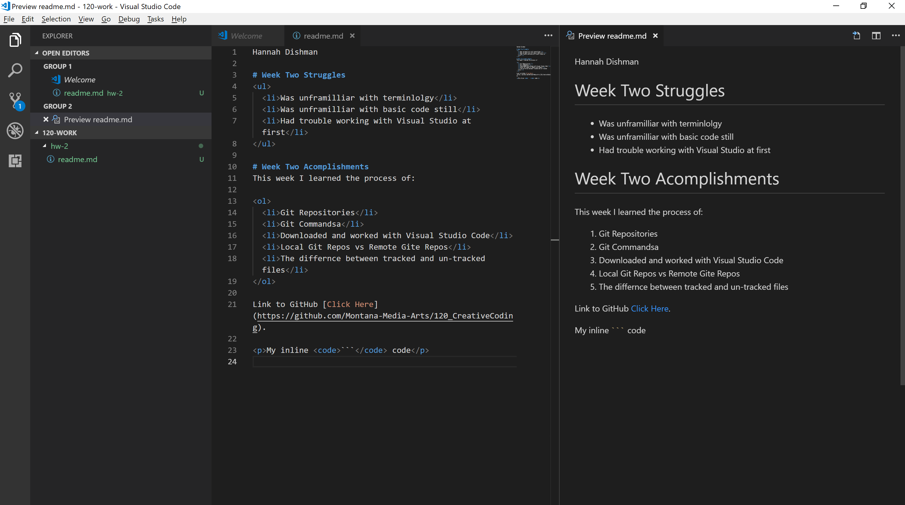

Hannah Dishman

# Week Two Struggles
<ul>
  <li>Was unfamiliar with terminology</li>
  <li>Was unfamiliar with basic code still</li>
  <li>Had trouble working with Visual Studio at first</li>
</ul>

# Week Two Accomplishments
This week I learned the process of: 

<ol>
  <li>Git Repositories</li>
  <li>Git Commands</li>
  <li>Downloaded and worked with Visual Studio Code</li>
  <li>Local Git Repos vs Remote Git Repos</li>
  <li>The difference between tracked and un-tracked files</li>
</ol>

Link to GitHub [Click Here](https://github.com/Montana-Media-Arts/120_CreativeCoding).

<p>My inline <code>```</code> code</p>


